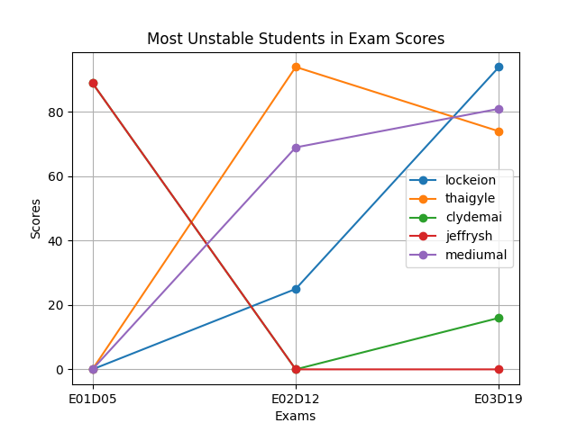
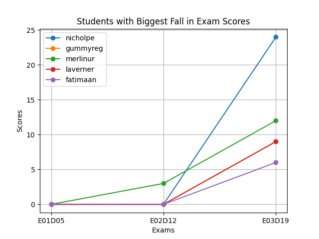
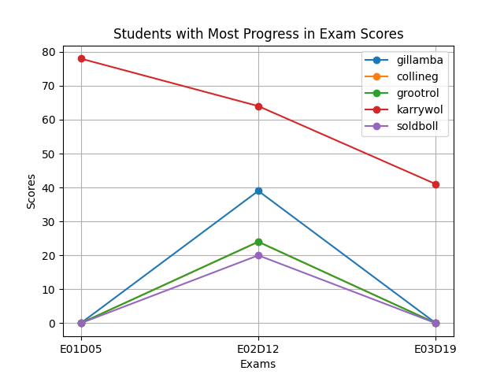

# stats_21bot

### Бот сделан для введения отчёта успеваемости и активности участников интенсивов в школе 21 в  филиалах Узбекистана


### Для парсинга необходим аккаунт на https://edu.21-school.ru/ (тоесть необходимо учиться или работать в школе 21)

=========================================================================================================================

## Перед парсингом обязательно создайте .env файл в основной директории и напишите там данные как в примере ниже 

### MAIN_BOT_TOKEN=' ' <- сюда пишите токен для вашего основного бота (bot.py в test_bot директории)
### TELEGRAPH_TOKEN=' ' <- cюда пишите токен от telegraph (это нужно для создание постов в https://telegra.ph/, что есть необходимо для бота)
### TOKEN_ADMIN_BOT=' ' <- cюда пишите токен от вашего бота для админки (admin.py в admin_bot директории)
### API_USERNAME=' ' <- cюда пишите ваш логин от платформы https://edu.21-school.ru 
### API_PASSWORD=' ' <- сюда пишите ваш пароль от платформы https://edu.21-school.ru 

## после создайте виртуальное окружение и установите нужные модули используя pip

```pip install -r requirements.txt```

=========================================================================================================================

## Основные директории:

### test_bot основной телеграм бот для показа отчётов и активностей (основной файл bot.py) 

#### Команда для запуска:
```python(3) bot.py```

### admin_bot бот для показа кол-ва пользователей в основном боте (файл для запуска admin.py)

#### Команда для запуска:
```python(3) admin.py```

### api (файл для запуска парсинга с api школы main.py, для парсинга используя selenium new_api.py)

#### Команда для запуска main.py и new_api.py:
```python(3) (main.py или new_api.py) (taskid или parse_students или parse_exam_progress) (месяц текущего интенсива)```

#### Примеры:
```python(3) main.py T01D01 february```
```python(3) new_api.py parse_students march```
```python(3) main.py parse_exam_progress june```


##### если вы передаете первым аргументом id проекта который нужно спарсить (id берите с платформы edu), то парсер соберёт результаты указанного проекта всех участников интенсива в Ташкенте и Самарканде за указанный месяц

###### по итогу вы получите -> (имя ученика, название проекта, тип проекта, статус, итоговая оценка)

###### Пример: (glassole, E01D05, EXAM, ACCEPTED, 100%)

### Внимание! (Edu платформа позволяет собирать данные только текущих интесивов!) (тоесть, если сейчас июнь и идёт интенсив вы сможете собирать данные только за июнь!)

##### если вы передаете parse_students то у вас начнётся собираться (logtime, exp, lvl, lvl_percent).

###### это всё выведится в терминал вместе с ником ученика (Пример: glassole, 12.0, 2105, 5, 20%)

##### parse_exam_progress построит графики 3 графика (запускать только по итогам экзамена) 

###### после запуска у вас появится графики:

### топ-5 самых нестабильных учеников по результатам экзаменов



### топ-5 самых провальных учеников по результатам экзаменов



### топ-5 учеников c наибольшим прогрессом по результатам экзаменов



## Совет: Лучше парсить через телеграм бота admin.py, там это делается с нажатием в пару кнопок
